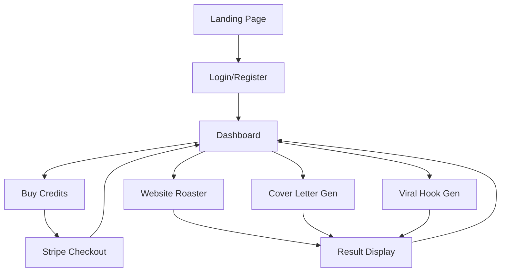

# Product Requirements Document: Creator AI Suite

## 1. Product Overview
Creator AI Suite is a React-based single-page application offering three distinct AI-powered tools to help creators and professionals optimize their digital presence.
It solves the problem of scattered productivity tools by bundling a Website Roaster, Cover Letter Generator, and Viral Hook Generator into one platform, monetized via a flexible credit system.

## 2. Core Features

### 2.1 User Roles
| Role | Registration Method | Core Permissions |
|------|---------------------|------------------|
| Guest | None | View landing page, cannot use tools. |
| Registered User | Email/Google Auth | Purchase credits, access dashboard, use AI tools (deducts credits), view history. |

### 2.2 Feature Module
Our Creator AI Suite requirements consist of the following main pages:
1.  **Landing Page**: Product introduction, tool showcase, pricing (credits).
2.  **Authentication**: Login and Registration.
3.  **Dashboard**: User credit balance, recent activity history, navigation to tools.
4.  **Website Roaster Tool**: Input interface for URL/Image, results display.
5.  **Cover Letter Tool**: Input for Resume/Job Description, generated text display.
6.  **Viral Hook Tool**: Input for topic, list of generated hooks.
7.  **Payment Page**: Buy credits via Stripe.

### 2.3 Page Details
| Page Name | Module Name | Feature description |
|-----------|-------------|---------------------|
| **Landing Page** | Hero Section | Catchy headline, brief description of 3 tools, "Get Started" CTA. |
| | Tool Showcase | Cards briefly explaining Roaster, Cover Letter, and Hooks tools. |
| **Dashboard** | Stats Panel | Display current credit balance. Button to "Buy Credits". |
| | Activity History | List of recent tool usages (e.g., "Generated Cover Letter - 2 mins ago"). |
| | Tool Grid | Quick links to access the 3 specific tools. |
| **Website Roaster** | Input Section | Field to enter Website URL or upload a screenshot. "Roast It" button (shows credit cost). |
| | Result Section | Display the AI-generated humorous/critical feedback. Copy to clipboard button. |
| **Cover Letter** | Input Section | Text area for "Resume Content" and "Job Description". "Generate" button. |
| | Result Section | Editable text area showing the generated cover letter. Copy/Download button. |
| **Viral Hook** | Input Section | Text input for "Topic" or "Niche". Dropdown for "Tone" (e.g., Controversial, Educational). "Generate" button. |
| | Result Section | List of 5-10 generated hooks. Copy button for each. |
| **Payment Page** | Pricing Plans | Select credit packages (e.g., 10 credits, 50 credits). |
| | Checkout | Stripe integration for payment processing. |

## 3. Core Process
**User Flow**:
1.  User lands on home page, sees tools.
2.  User signs up/logs in.
3.  User buys credits if balance is low.
4.  User selects a tool (e.g., Website Roaster).
5.  User provides input; Backend processes request via AI; Credits are deducted.
6.  User views and saves results.

## 4. User Interface Design

### 4.1 Design Style
*   **Primary Color**: Deep Indigo/Purple (Creative, Tech vibe).
*   **Secondary Color**: Vibrant Teal/Cyan (Accents).
*   **Button Style**: Rounded corners, slightly elevated (shadow), solid primary color.
*   **Font**: Inter or Roboto (Clean, readable sans-serif).
*   **Layout**: Sidebar navigation (collapsible) for tools + Main content area. Card-based layout for forms and results.

### 4.2 Page Design Overview
| Page Name | Module Name | UI Elements |
|-----------|-------------|-------------|
| Dashboard | Overview Cards | 3 Cards in a row: Credits, Tools Used, History. Clean iconography. |
| Tools Pages | Split View | Left side: Input forms (clear labels). Right side: Output/Results (markdown support for text). |

### 4.3 Responsiveness
*   **Strategy**: Desktop-first, but fully responsive.
*   **Mobile**: Sidebar becomes a hamburger menu. Split views stack vertically (Input on top, Results below).
