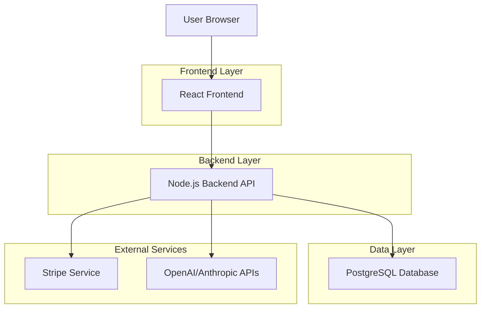
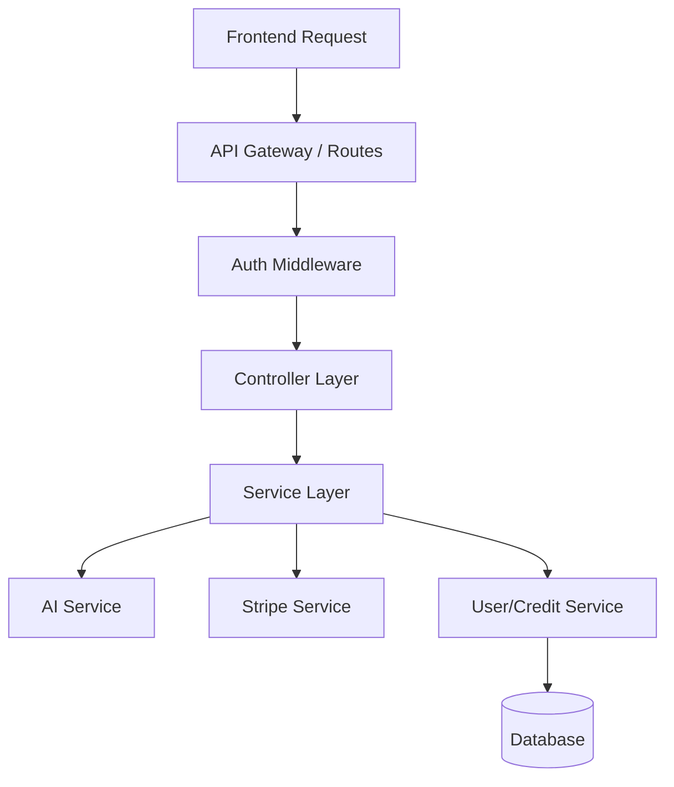
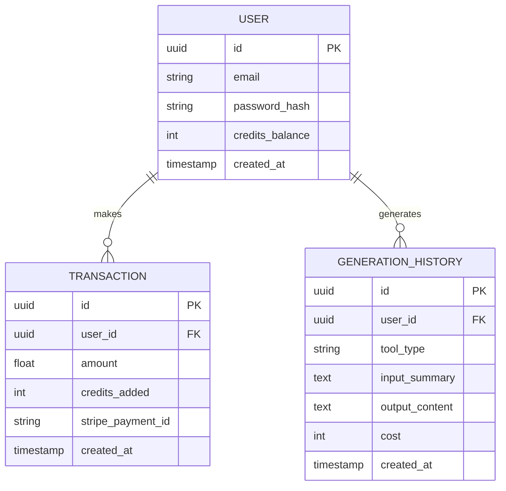

# Technical Architecture Document: Creator AI Suite

## 1. Architecture Design

The application follows a standard Client-Server architecture. The React frontend handles user interaction, while the Node.js backend manages business logic, AI API orchestration, credit management, and database interactions.



## 2. Technology Description
*   **Frontend**: React@18 + TailwindCSS + Vite.
    *   State Management: React Context or Zustand (for user credits/session).
    *   Routing: React Router DOM.
*   **Initialization Tool**: `vite-init`
*   **Backend**: Node.js + Express.
    *   Authentication: JWT based auth or Supabase Auth integration (managed via Node).
*   **Database**: PostgreSQL (via Supabase or standalone).
    *   ORM: Prisma or Drizzle (recommended for type safety).
*   **AI Integration**:
    *   Vision: OpenAI GPT-4o (for Website Roaster).
    *   Text: OpenAI GPT-4o or Claude 3.5 Sonnet (for Cover Letters & Hooks).

## 3. Route Definitions
| Route | Purpose |
|-------|---------|
| `/` | Landing page. |
| `/login` | User authentication. |
| `/dashboard` | User overview, credits, history. |
| `/tools/roaster` | Website Roaster tool interface. |
| `/tools/cover-letter` | Cover Letter Generator interface. |
| `/tools/hooks` | Viral Hook Generator interface. |
| `/payment` | Credit purchase page. |

## 4. API Definitions

### 4.1 Core API

**User Info & Credits**
`GET /api/user/me`
*   **Response**: `{ id, email, credits_balance }`

**Generate Content (Generic for tools)**
`POST /api/generate/:toolType`
*   **Param**: `toolType` (roaster, cover-letter, hooks)
*   **Request Body**:
    ```json
    {
      "inputs": {
        "url": "https://example.com", // For roaster
        "resume_text": "...", // For cover letter
        "topic": "..." // For hooks
      }
    }
    ```
*   **Response**:
    ```json
    {
      "result": "Generated content...",
      "credits_deducted": 10,
      "remaining_credits": 90
    }
    ```

**Payment Intent**
`POST /api/payment/create-intent`
*   **Request**: `{ packageId: "pack_10_credits" }`
*   **Response**: `{ clientSecret: "..." }`

## 5. Server Architecture Diagram



## 6. Data Model

### 6.1 Data Model Definition



### 6.2 Data Definition Language (Example)

```sql
-- Users Table
CREATE TABLE users (
    id UUID PRIMARY KEY DEFAULT gen_random_uuid(),
    email VARCHAR(255) UNIQUE NOT NULL,
    password_hash VARCHAR(255) NOT NULL,
    credits_balance INTEGER DEFAULT 0,
    created_at TIMESTAMP WITH TIME ZONE DEFAULT NOW()
);

-- History Table
CREATE TABLE generation_history (
    id UUID PRIMARY KEY DEFAULT gen_random_uuid(),
    user_id UUID REFERENCES users(id),
    tool_type VARCHAR(50) NOT NULL,
    input_summary TEXT,
    output_content TEXT,
    cost INTEGER NOT NULL,
    created_at TIMESTAMP WITH TIME ZONE DEFAULT NOW()
);
```
